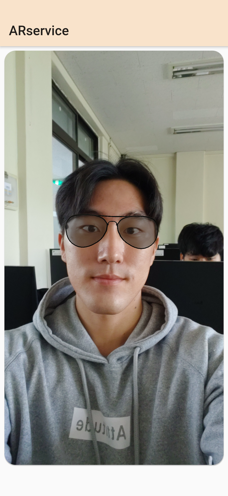
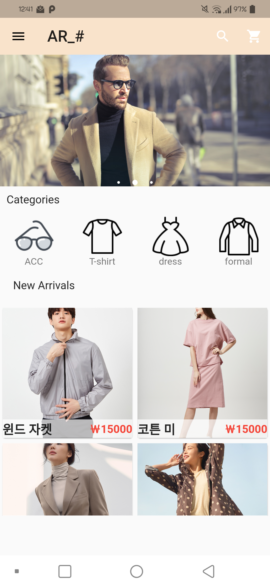
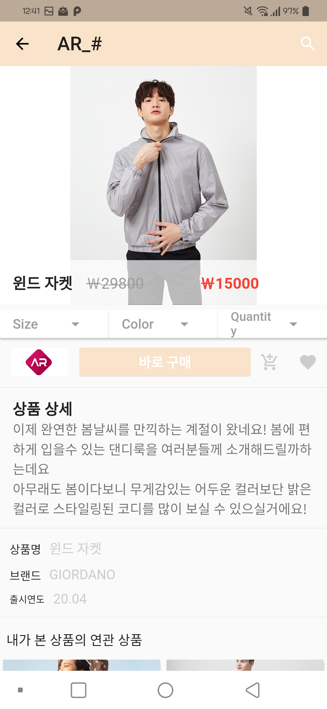
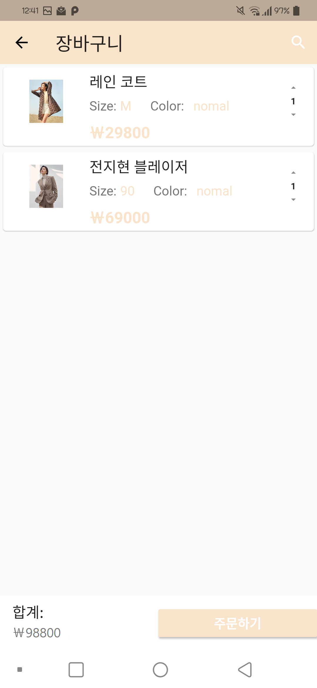

# ARShop
Use augmented reality to create an effect similar to what you actually wore.

## Preview
  
|ARService                      |Main                       |
|-------------------------------|-----------------------------|
||          |

 

|Product                     |Cart                       |
|-------------------------------|-----------------------------|
||          |

## Used 
- Flutter 1.12.13
- Dart 2.7.2
- ARCore Unity SDK v1.17.0
- Firebase
