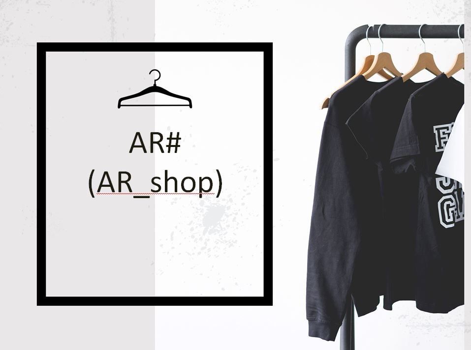

# AR_shop

AR_shop make flutter

- You can't see yourself wearing the product on the online shopping mall. There is the hassle of returning and exchanging. In order to solve this problem, augmented reality is used to produce a similar effect as for the actual application.

- Augmented reality provides an environment where you can experience the product in a virtual environment without the actual product. These features allow augmented reality to redefine the concept of product demonstration and completely reverse the customer's experience, which allows customers to have more accurate expectations of their products. Therefore, by gaining confidence in your purchasing decisions, you can promote purchases in virtual reality. In this respect, augmented reality can also address the return issues caused by online shopping, which customers do not experience, but rely solely on photos and descriptions to purchase the product. It is expected to address the costly return issue of online distribution, while also reducing customer complaints.

## Preview
### -main

### -product

### -cart

### -ARservice

## Used 
- flutter 1.12.13
- dart 2.7.2
- ARCore Unity SDK v1.17.0
- firebase
